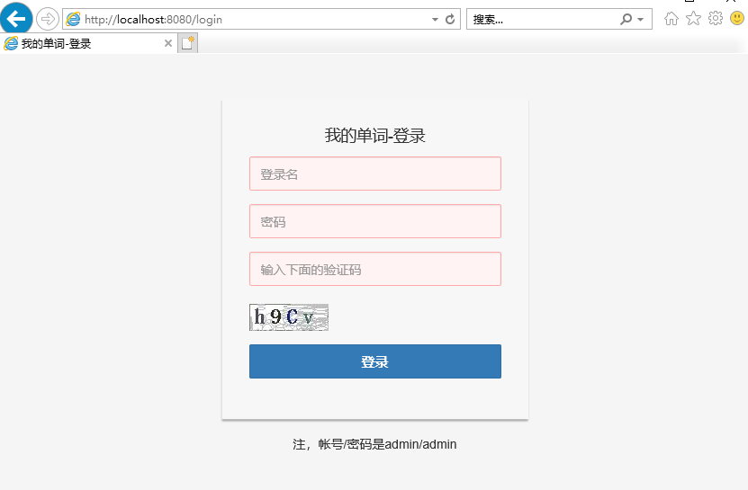
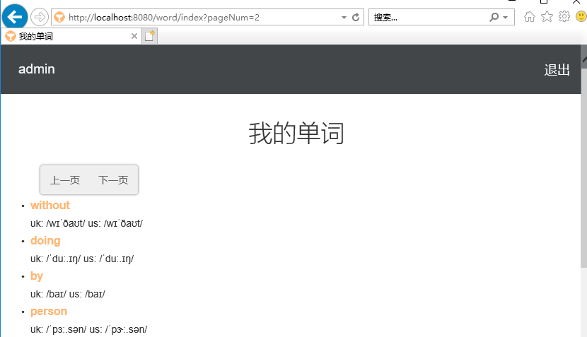

# MyDict

MyDict 是一个使用grails3框架写的程序，里面功能含有用户登录与单词列表显示。本程序是来自于金色数据示例程序，用于演示采集数据自动登录功能。

该程序使用h2内存数据库，但程序在启动时会自动加载带有1000+单词数据,以用作为示例。

# war包启动

```bash
java -jar mydict.war
```

运行之后，可以打开浏览器访问 http://localhost:8080/ ，则会看到下图：



然后输入用户名和密码(都是admin),以及相应验证码之后，将会提交服务器验证。如果验证错误，将会提示。反之如果正确，将会进入我的单词首页。如下图所示：



然后可以翻页显示。


# 关于金色数据

金色数据平台有一套绕过登录来采集数据的机制(半自动/全自动登录)，让抓取需要登录的内容成为可能。

关于更多内容，可以查看金色数据官网， https://golddata.100shouhou.com


# 许可证

MyDict 采用[Apache License, Version 2.0](http://www.apache.org/licenses/LICENSE-2.0.html) 协议。
